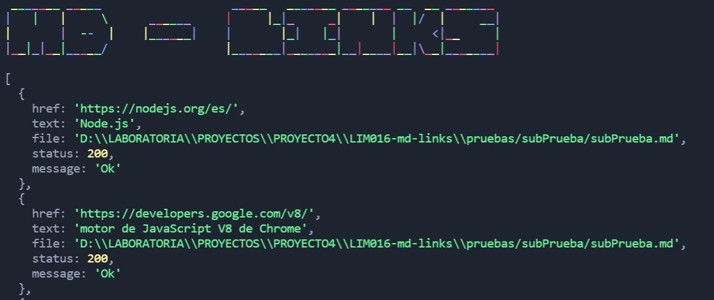
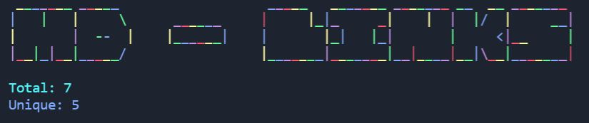
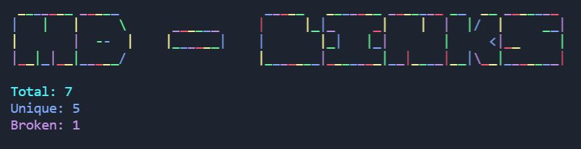
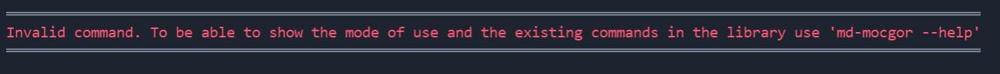

# Markdown Links

***

***

## 1. Preamble

Markdown is a very popular lightweight markup language among developers. It is used on many platforms
they handle plain text (GitHub, forums, blogs, ...), and it is very common to find several files in that format in any type of repository.

These `Markdown` files usually contain _links_ (links) that are often broken or no longer valid, and that greatly damages the value of the information that you want to share.

## 2. Project summary

La librería Md-mocgor se encarga de verificar links de un archivo Markdown, mostrando reportes estadísticos de enlaces totales, rotos o no válidos.

## 3. Flowcharts
### Flowcharts API


### Flowcharts CLI


## 4. Installation

For the installation of this library it will be necessary to execute the following command line in your terminal

``` js
npm i md-mocgor
```

## 5. User guide
### Welcome to Md-Links
``` js
md-mocgor
```


### When you enter the command --help
``` js
md-mocgor --help
```


### When you enter the path

``` js
md-mocgor ./pruebas
```


### When you enter an invalid path

``` js
md-mocgor ../routeFail
```


### When you enter a route that has no links
``` js
md-mocgor ./pruebas/prueba.md
```


### When you enter a valid path with opcion --validate
``` js
md-mocgor ./pruebas --validate
```


### When you enter a valid path with opcion --stats
``` js
md-mocgor ./pruebas --stats
```


### When you enter a valid path with --stats --validate 
``` js
md-mocgor ./pruebas --stats --validate
```


### When you enter a valid path with --validate --stats
``` js
md-mocgor ./pruebas --validate --stats 
```


### When you enter a valid path with an invalid option

``` js
md-mocgor ./pruebas --valida
```

