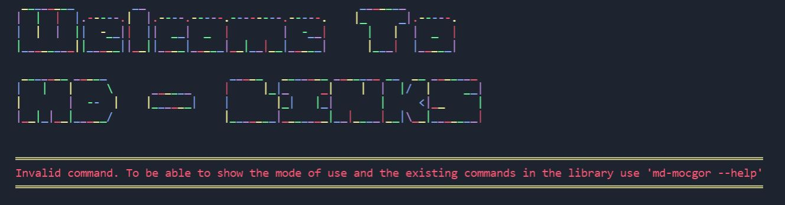
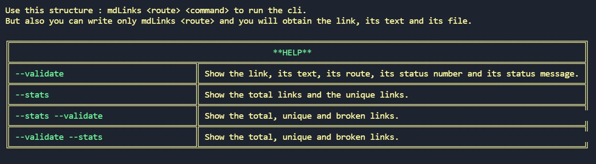
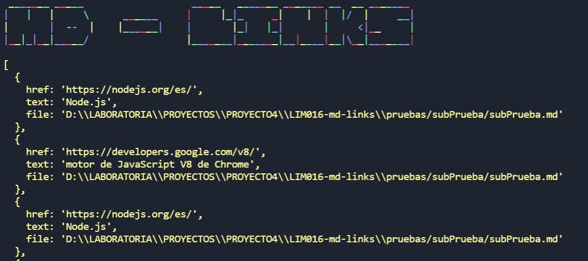
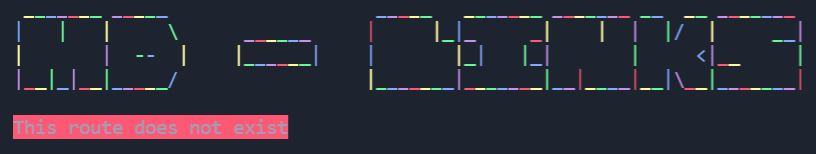
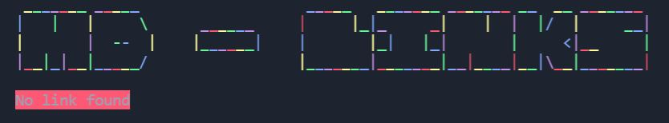

# Markdown Links

***

***

## 1. Preámbulo

Markdown es un lenguaje de marcado ligero muy popular entre developers. Es usado en muchísimas plataformas que
manejan texto plano (GitHub, foros, blogs, ...), y es muy común encontrar varios archivos en ese formato en cualquier tipo de repositorio.

Estos archivos `Markdown` normalmente contienen _links_ (vínculos/ligas) que muchas veces están rotos o ya no son válidos y eso perjudica mucho el valor de la información que se quiere compartir.

## 2. Resumen del proyecto

La librería Md-mocgor se encarga de verificar links de un archivo Markdown, mostrando reportes estadísticos de enlaces totales, rotos o no válidos.

## 3. Diagramas de flujo
### Diagrama de flujo API


### Diagrama de flujo CLI


## 4. Instalación


Para la instalación de esta libreria sera necesario ejecutar el siguiente comando en tu terminal

``` js
npm i md-mocgor
```

## 5. Guía de uso 
### Welcome to Md-Links
``` js
md-mocgor
```


### Cuando ingresas el comando --help
``` js
md-mocgor --help
```


### Cuando ingresas la ruta

``` js
md-mocgor ./pruebas
```


### Cuando ingresas una ruta no válida

``` js
md-mocgor ../routeFail
```


### Cuando ingresas una ruta que no tiene links
``` js
md-mocgor ./pruebas/prueba.md
```


### Cuando ingresas una ruta válida con opcion --validate
``` js
md-mocgor ./pruebas --validate
```
[imagen9](img/cliValidate.JPG)

### Cuando ingresas una ruta válida con opcion --stats
``` js
md-mocgor ./pruebas --stats
```
[imagen10](img/cliStats.JPG)

### Cuando ingresas una ruta válida con opcion --stats --validate 
``` js
md-mocgor ./pruebas --stats --validate
```
[imagen11](img/cliStatsValidate.JPG)

### Cuando ingresas una ruta válida con opcion --validate --stats
``` js
md-mocgor ./pruebas --validate --stats 
```
[imagen12](img/cliStatsValidate.JPG)

### Cuando ingresas una ruta válida con opcion validate mal escrito

``` js
md-mocgor ./pruebas --valida
```
[imagen13](img/cliInvalid.JPG)
